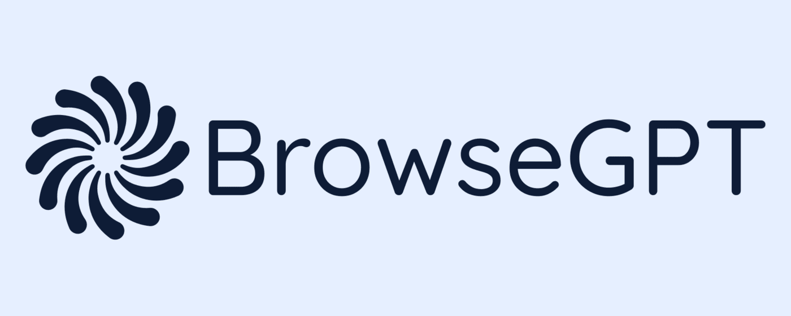

<div align="center">
    
    
    
    
</div>

<br>



<br>

> An AI assistant for your browser. Now available to download from the [Chrome Store](https://chrome.google.com/webstore/detail/browsegpt/ijdehllahgkhhcoffcohgmbebcchdknb)!

## Table of contents

-   [General info](#general-info)
-   [Technologies](#technologies)
-   [Development](#development)
-   [Contact](#contact)

## General info

A browser extension using the sidepanel API that allows users to persistently interact with an AI assistant whilst browsing the web. Under the hood the extension is integrated to OpenAI's GPT3.5.

## Technologies

-   Express
-   Postgresql
-   Prisma
-   React
-   tRPC
-   Tailwind
-   Typescript

## Development

You need to be running Node v18 for this project (as specified in the .nvmrc file). We suggest using [NVM](https://github.com/nvm-sh/nvm) to manage your Node versions.

From the project root, run the below to install dependencies.

```
npm install
```

The project uses Postgres and Prisma for database management. Download [Postgres](https://www.postgresql.org/download/), create a database and add your database connection URL to the appropriate .env file (your .env files should match the format and location of the .env.example files).

Every time you change the database schema in schema.prisma, you should run the below command to generate a new migration script for your schema changes and apply the changes to your database.

```
npm run migrate:dev --migration={name-for-your-migration}
```

To lint the project, run the below command from the project root.

```
npm run lint
```

To perform development run the below command. This will compile both the back end and extension code into dist folders for the chosen extension, start a server at port 3000, open the browser with the extension pre-installed and watch for changes across the two workspaces.

```
npm run dev --extension={chrome|firefox|edge}
```

Whenever changes are made to the codebase, make sure to update the CHANGELOG.md file with descriptions are your changes. 

To create a production build of an extension, run the below. This will output to a build directory for the chosen extension.

```
npm run prod --extension={chrome|firefox|edge}
```

To package an extension ready for uploading to the appropriate store, run the below. This will create a new compressed build and output to a packages directory for the chosen extension.

```
npm run package --extension={chrome|firefox|edge}
```

## Contact

Created by [@BrowseGPT](mailto:general@browsegpt.app) - if you'd like to chat about feature requests, contributing or anything else please get in touch!