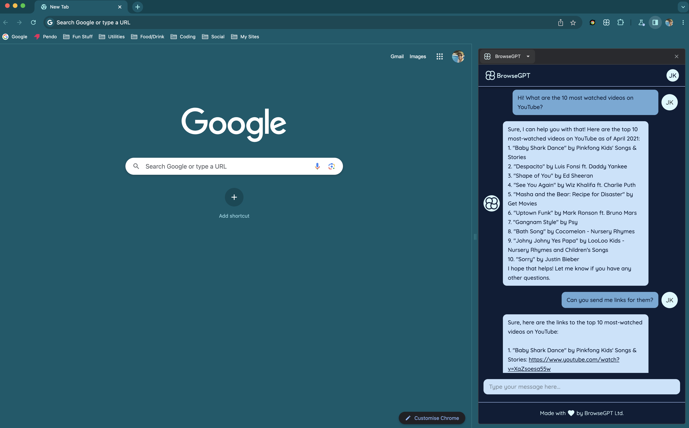

# BrowseGPT

> An AI assistant for your browser

## Table of contents

-   [General info](#general-info)
-   [Screenshot](#screenshot)
-   [Technologies](#technologies)
-   [Development](#development)
-   [Contributing](#contributing)
-   [Contact](#contact)

## General info

A Chrome extension using the sidepanel API that allows users to persistently interact with an AI assistant whilst browsing the web. Under the hood the extension is integrated to OpenAI's GPT3.5.

## Screenshot



## Technologies

-   Express
-   React
-   tRPC
-   Tailwind
-   Typescript

## Development

You need to be running Node v18 for this project (as specified in the .nvmrc file). Go into both the server and extension folders and install dependencies in each.

```
npm install
```

To start the backend server in development mode, from the server folder run the below. This will transpile the backend code into a dist folder, start the server and watch for changes.

```
npm run dev
```

To perform frontend development, from the extension folder run the below. This will transpile the frontend code into a dist folder and watch for changes. Download the beta version of Google Chrome, then go to Chrome extensions, turn on development mode and load the dist folder. Click on the extension icon to open the sidepanel, or use the shortcut CMD + SHIFT + SPACE. Follow the instructions in the extension to get your API key from OpenAI (this is needed for development but is not actually used by default, see ./server/src/routes/conversation.ts).

```
npm run watch
```

To see any frontend changes in the browser you'll need to manually reload the extension by clicking the refresh button from the extensions page. Alternatively download the 'Extensions Reloader' Chrome extension to make this easier.

If performing backend and frontend development, when making changes to the backend routes, you may need to manually stop/start the backend server and/or restart your Typescript server in order for tRPC to pick up the new router types on the frontend.

To lint the project, run the below command from the server folder to lint the server, or from the extension folder to lint the extension.

```
npm run correct
```

## Contributing

I am open to any and all contributions that you feel would improve the project, however there is a list of things to do in the issues section on GitHub. These are ordered from most to least important. Feel free to create a pull request for me to review, or alternatively get in touch using the details below.

## Contact

Created by [@joshuakent](mailto:josh.kent94@yahoo.co.uk) - if you'd like to chat about feature requests, contributing or anything else please get in touch!