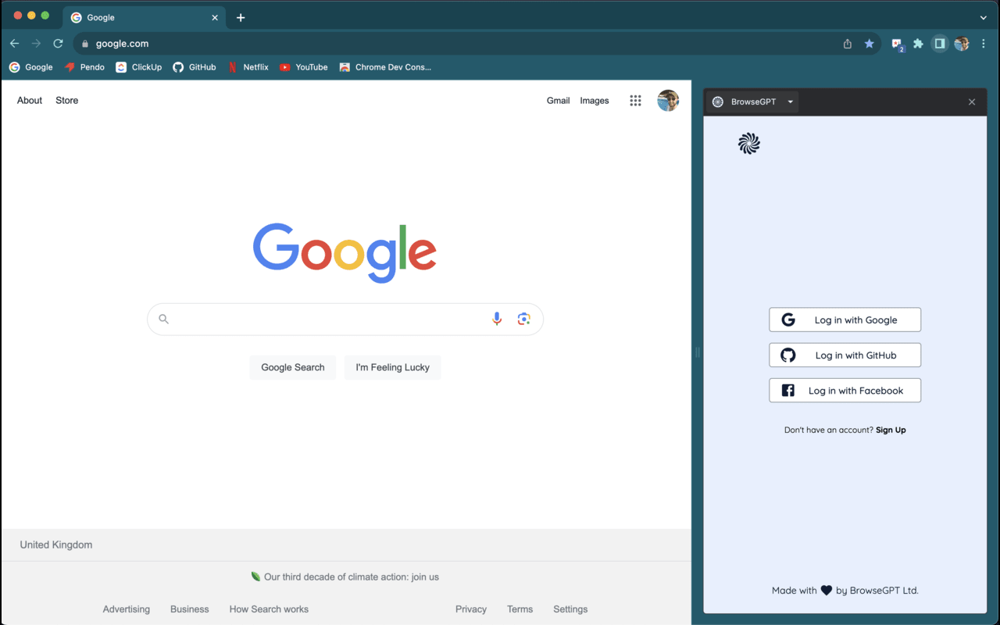
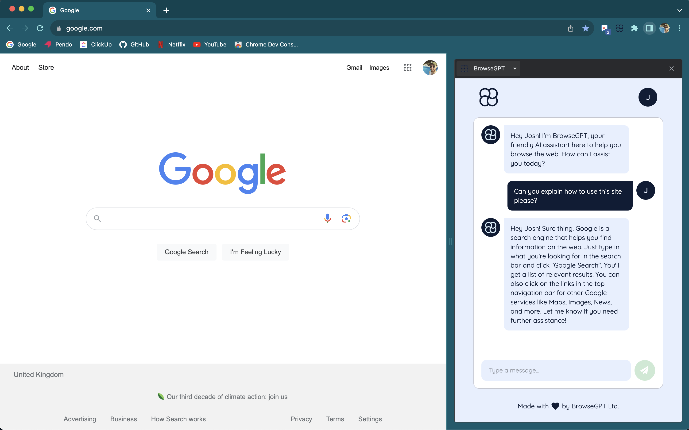
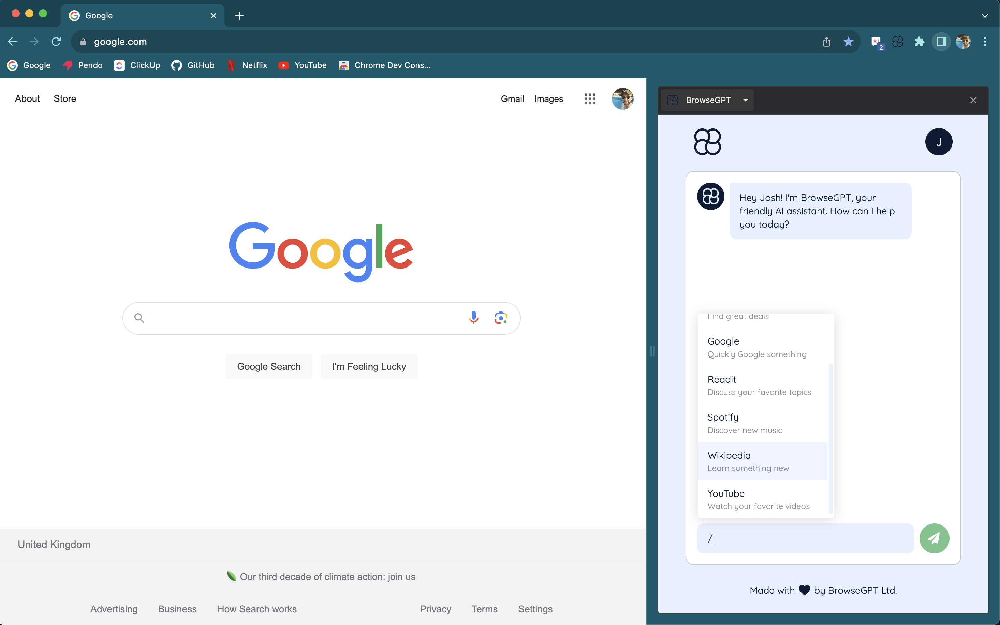
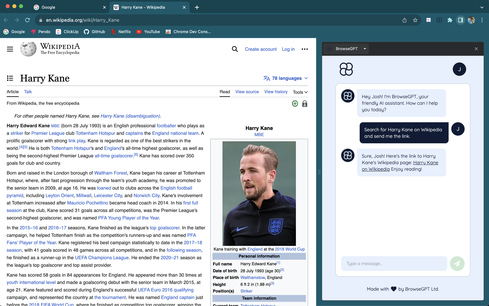

<p align="center">
    
    
    
</p>
<h1 align="center">
    BrowseGPT
</h1>

> An AI assistant for your browser. Now available to [download](https://chrome.google.com/webstore/detail/browsegpt/ijdehllahgkhhcoffcohgmbebcchdknb) from the Chrome Store!

## Table of contents

-   [General info](#general-info)
-   [Usage](#usage)
-   [Technologies](#technologies)
-   [Development](#development)
-   [Contact](#contact)

## General info

A Chrome extension using the sidepanel API that allows users to persistently interact with an AI assistant whilst browsing the web. Under the hood the extension is integrated to OpenAI's GPT3.5.

## Usage

Sign up/log in securely using OAuth.



Chat with an AI assistant across your whole browser experience. The AI knows your name and location (if available via your browser).


It also knows the site you're currently on.



Type '/' to see a list of quick search prompts.



And instantly see the result in a new tab.



## Technologies

-   Express
-   Postgresql
-   Prisma
-   React
-   tRPC
-   Tailwind
-   Typescript
-   Turborepo

## Development

You need to be running Node v18 for this project (as specified in the .nvmrc file). We suggest using [NVM](https://github.com/nvm-sh/nvm) to manage your Node versions.

The project also uses Turborepo to manage the front and back end workspaces simultaneously. Run the below to install Turborepo globally (substitute in yarn if necessary).

```
npm install turbo@latest --global
```

From the project root, run the below to install dependencies.

```
npm install
```

The project uses Postgres and Prisma for database management. Download [Postgres](https://www.postgresql.org/download/), create a database and add your database connection URL to the appropriate .env file (your .env files should match the format and location of the .env.example files). Then to create the tables in your database, run the below.

```
turbo prisma:migrate:dev
```

You may get an error saying you need to use an interactive command line for this, if so, run the below instead.

```
cd server && npm run prisma:migrate:dev
```

Every time you change the database schema in schema.prisma, you should also run the above command with a name argument to generate a new migration script for your schema changes and apply the changes to your database.

```
turbo prisma:migrate:dev -- --name={name-for-your-migration}
```

Then create initial development builds for both front and back end.

```
turbo build
```

To perform development, run the below. This will compile both front and back end, start a server at port 3000, and watch for changes across the entire codebase.

```
turbo dev
```

To lint the project, run the below command from the project root.

```
turbo correct
```

Download the latest version of [Google Chrome](https://www.google.com/intl/en_uk/chrome/dr/download/), then go to Chrome extensions, turn on development mode, click 'Load unpacked' and select the dist folder within the extension directory. Click on the extension icon to open the sidepanel, or use the shortcut CMD + SHIFT + SPACE.

To see any front end changes in the browser, you'll need to manually reload the extension by clicking the refresh button from the extensions page. Alternatively, download the [Extensions Reloader](https://chrome.google.com/webstore/detail/extensions-reloader/fimgfedafeadlieiabdeeaodndnlbhid) to make this easier.

## Contact

Created by [@joshuakent](mailto:josh.kent94@yahoo.co.uk) - if you'd like to chat about feature requests, contributing or anything else please get in touch!