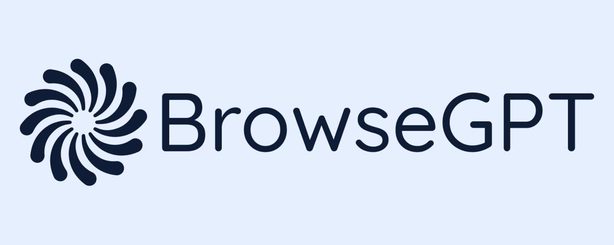

<p align="center">
    
    
</p>

<br>



<br>

## Development

To develop the Chrome extension, run the below. This will compile the back end code and Chrome extension, start a server at port 3000, and watch for changes across the two workspaces.

```
turbo dev:chrome
```

You may get an error saying you need to use an interactive command line for this, if so, run the below first.

```
cd server && npm run prisma:migrate:dev
```

To create a production build of the extension, run the below.

```
turbo build:chrome
```

To use the extension in the browser, download and open the latest version of [Google Chrome](https://www.google.com/intl/en_uk/chrome/dr/download/), then go to the extensions page, turn on developer mode, click 'Load unpacked' and select the dist folder within the chrome-extension directory. Click on the extension's icon to open the sidepanel, or use the shortcut CMD + SHIFT + SPACE.

To see any front end changes in the browser, you'll need to manually reload the extension by clicking the refresh button from the extensions page. Alternatively, download the [Extensions Reloader](https://chrome.google.com/webstore/detail/extensions-reloader/fimgfedafeadlieiabdeeaodndnlbhid) to make this easier.
